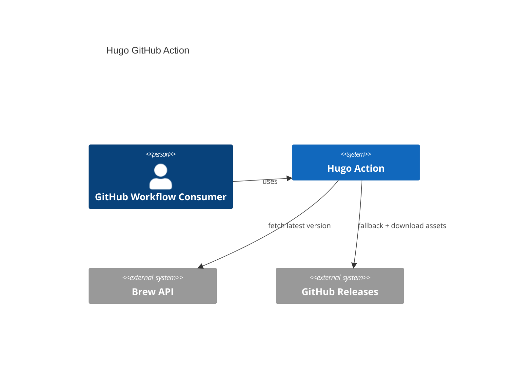
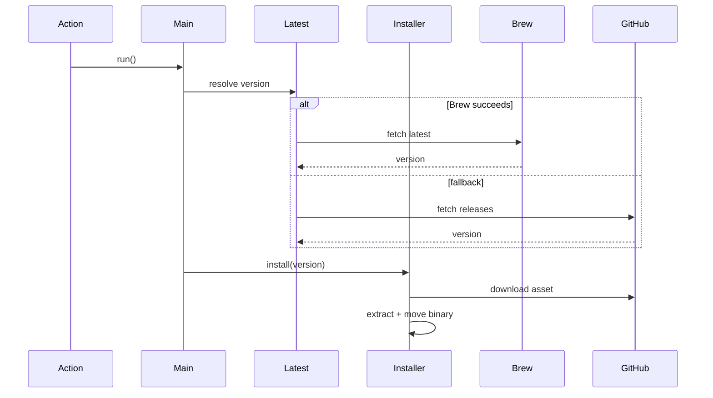
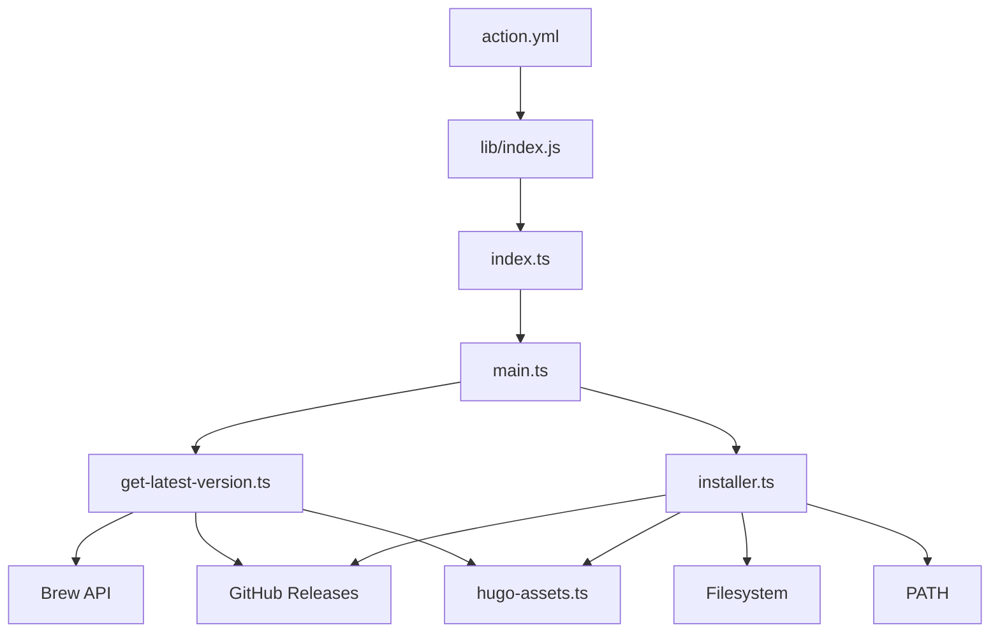
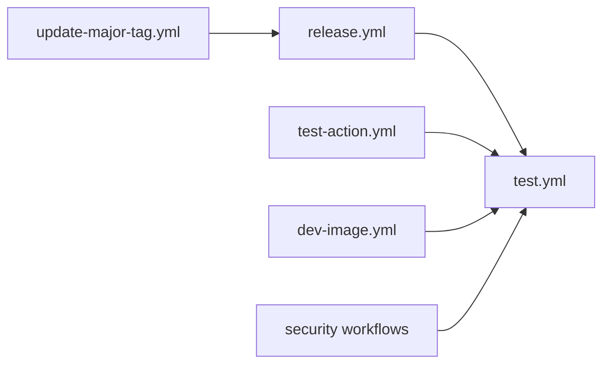

# Architecture

This repository is a TypeScript-based JavaScript GitHub Action that installs Hugo on a GitHub Actions runner.

The codebase has three distinct concerns:

* action runtime logic
* repository validation and release automation
* local contributor tooling

---

# System overview



---

# Runtime flow

The published action is declared in [`action.yml`](../action.yml) and executes the bundled file in [`lib/index.js`](../lib/index.js).
That bundle is generated from the TypeScript source in [`src/`](../src).

## Execution sequence



## Runtime path

1. [`src/index.ts`](../src/index.ts) is the action entrypoint and converts uncaught runtime failures into `core.setFailed(...)`.
2. [`src/main.ts`](../src/main.ts) reads inputs, resolves the Hugo version, runs the installer, and then calls `hugo version` for confirmation.
3. [`src/get-latest-version.ts`](../src/get-latest-version.ts) resolves `latest`.
   It prefers the Brew formula API and falls back to the GitHub Releases API when Brew lookup fails.
4. [`src/installer.ts`](../src/installer.ts) uses `hugo-assets.ts` to detect OS and architecture, tries direct candidate asset URLs first, then falls back to release-asset metadata lookup when direct URLs return 404s.
5. [`src/hugo-assets.ts`](../src/hugo-assets.ts) defines supported platforms, architectures, and the mapping layer for asset names and candidate download URLs.
6. [`src/constants.ts`](../src/constants.ts) defines repository and command constants.

## Runtime structure



---

# Build and artifact model

This repository commits its generated action bundle:

* source of truth: [`src/`](../src)
* generated runtime artifact: [`lib/index.js`](../lib/index.js)

The build step is:

```sh
corepack npm run build
```

That runs `ncc` and rewrites `lib/`.

CI verifies that the committed artifact stays in sync with source and dependency changes.

---

# Test strategy

The test strategy separates orchestration from lower-level behavior, following a "Testing Trophy" approach where integration tests verify core flows while unit tests cover exhaustive edge cases:

* [`__tests__/unit/`](../__tests__/unit): Exhaustive unit tests with heavy mocking for individual modules.
* [`__tests__/integration/action.test.ts`](../__tests__/integration/action.test.ts): Full-path integration testing of the action entrypoint with minimal mocking.
* [`__tests__/unit/index.test.ts`](../__tests__/unit/index.test.ts): Entrypoint error handling unit tests.
* [`__tests__/unit/main.test.ts`](../__tests__/unit/main.test.ts): Orchestration logic.
* [`__tests__/unit/installer.test.ts`](../__tests__/unit/installer.test.ts): Installer behavior and platform-specific path resolution.
* [`__tests__/unit/get-latest-version.test.ts`](../__tests__/unit/get-latest-version.test.ts): Version resolution logic.
* [`__tests__/unit/hugo-assets.test.ts`](../__tests__/unit/hugo-assets.test.ts): Asset URL generation and platform/architecture mapping.

Vitest is used with deterministic fixtures:

* `latest` for current behavior
* one pinned version for compatibility

---

# Workflow structure



The repository automation is split by responsibility:

* [`test.yml`](../.github/workflows/test.yml)
  Runs formatting, linting, type-checking, build, tests, and bundle verification

* [`test-action.yml`](../.github/workflows/test-action.yml)
  Verifies the action entrypoint

* [`dev-image.yml`](../.github/workflows/dev-image.yml)
  Validates the Docker-based dev image

* [`release.yml`](../.github/workflows/release.yml)
  Runs semantic-release after `test.yml` succeeds

* [`update-major-tag.yml`](../.github/workflows/update-major-tag.yml)
  Maintains moving major tags

* security workflows:
  [`codeql-analysis.yml`](../.github/workflows/codeql-analysis.yml),
  [`dependency-review.yml`](../.github/workflows/dependency-review.yml),
  [`actions-security.yml`](../.github/workflows/actions-security.yml),
  [`conventional-pr.yml`](../.github/workflows/conventional-pr.yml)

---

# Tooling and local setup

The repository standardizes on:

* Node from [`.nvmrc`](../.nvmrc)
* npm from [`package.json`](../package.json)
* Corepack as an activation layer

Contributor setup is documented in [`docs/local-setup.md`](./local-setup.md).

Important helpers:

* [`Makefile`](../Makefile): Docker-based commands
* [`Dockerfile`](../Dockerfile): dev image
* [`.husky/`](../.husky): git hooks
